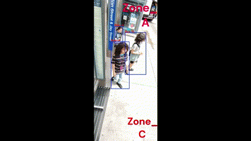

# YOLOv4 - Person Detection and Segmentation

## Introduction
This project showcases the implementation of the YOLO_v4 architecture to efficiently detect and classify individuals at NYC MTA bus stops. It optimizes operations by incorporating bus stand segmentation based on bus numbers. Additionally, the project integrates person detection and classification by labeling individuals according to their intended bus for travel.

This project aims to decrease the frequency of unnecessary stops for buses in the NYC area. Data analysis and surveys indicate that by eliminating just 1% of these unnecessary stops, we can annually save 39 days of time, resulting in significant cost reductions, improved efficiency, and an enhanced passenger experience.

## Installation
1. Clone the repository:
   ```
   $ git clone https://github.com/satyapalsinh10/YOLOv4_Person_Detection_and_Segmentation.git
   $ pip install requirements.txt
   ```

2. Configure Darknet Makefile::
   ```
   # Change the Directory to darknet and edit the Makefile to enable GPU, OpenCV, and LIBSO:
   cd /build/darknet/

   $ sed -i 's/OPENCV=0/OPENCV=1/' Makefile
   $ sed -i 's/GPU=0/GPU=1/' Makefile
   $ sed -i 's/CUDNN=0/CUDNN=1/' Makefile
   $ sed -i 's/CUDNN_HALF=0/CUDNN_HALF=1/' Makefile
   $ sed -i 's/LIBSO=0/LIBSO=1/' Makefile

3. Build Darknet:

   ```
   # Build Darknet using the following command:
   $ make
   ```

4. Download YOLOv4 Weights:
   ```
   # Download the YOLOv4 weights file:
   $ wget -O yolov4-csp.weights https://github.com/AlexeyAB/darknet/releases/download/darknet_yolo_v4_pre/yolov4-csp.weights
    ```

5. Run Python Script:
   ```
   # Provide the path for the input video and the path to save the output video.
   $ python detection.py --video_path /path/to/your/input_video.mp4 --output_path /path/to/your/output_video.mp4
   ```


## Results:

The below results display the output video detecting the persons present at the NYC bus stop and also classify them based on which bus they plan to travel, based on their position on the bus stop. 
<p align="center">
  
</p>


## References

To train the network on a custom dataset you can follow the github [link](https://github.com/AlexeyAB/darknet?tab=readme-ov-file) or configure the above file with the official darknet repository.


## Citation

  ```
@misc{bochkovskiy2020yolov4,
      title={YOLOv4: Optimal Speed and Accuracy of Object Detection}, 
      author={Alexey Bochkovskiy and Chien-Yao Wang and Hong-Yuan Mark Liao},
      year={2020},
      eprint={2004.10934},
      archivePrefix={arXiv},
      primaryClass={cs.CV}
}
  ```

```
@InProceedings{Wang_2021_CVPR,
    author    = {Wang, Chien-Yao and Bochkovskiy, Alexey and Liao, Hong-Yuan Mark},
    title     = {{Scaled-YOLOv4}: Scaling Cross Stage Partial Network},
    booktitle = {Proceedings of the IEEE/CVF Conference on Computer Vision and Pattern Recognition (CVPR)},
    month     = {June},
    year      = {2021},
    pages     = {13029-13038}
}
```
